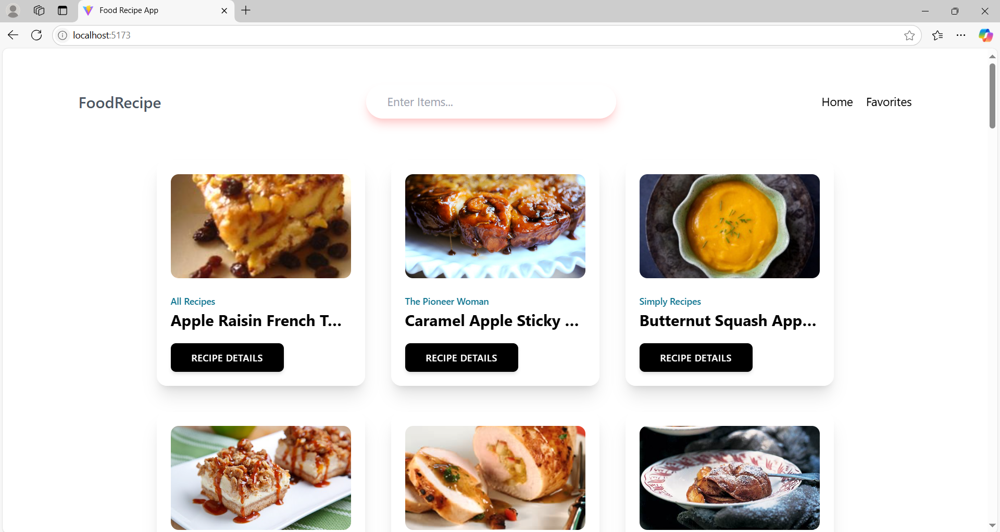

# Food Recipe App

A web application built using **React** that allows users to search for recipes, view recipe details, and save their favorite recipes.

## Screenshots

## Features

- **Search for recipes**: Find recipes based on the food item entered by the user.
- **Recipe details**: View detailed information about each recipe.
- **Favorite recipes**: Save recipes to a favorites list and remove them as desired.

## Tech Stack

- **Frontend**: React.js
- **Styling**: Tailwind CSS
- **State Management**: React's `useState`, `useContext` and `useEffect` hooks

## APIs

This project uses the **Forkify API** to fetch recipes based on user search queries.

- **API Endpoint**: [https://forkify-api.herokuapp.com/api/v2/recipes](https://forkify-api.herokuapp.com/api/v2/recipes)  
- The API provides recipe data, including ingredients, instructions, and other details for a given food item.